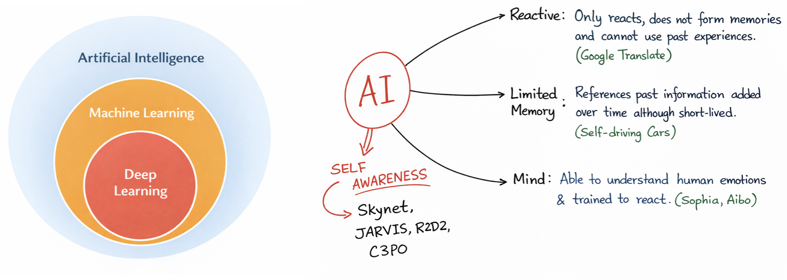

# A mini course in Machine Learning for Physicists
## Overview

```{figure} ../StringE.png
:align: center
:width: 180px

<div style="text-align:center;">
<strong>String-E welcomes you to this course</strong>
</div>
```

This course page can also be thought of as my notes on basics of Machine Learning. These particular notes are built upon the **Machine Learning** course web page for the US CMS PURSUE workshop 2025, available here:  [ML PURSUE 2025 course page](https://chattopadhyaya.github.io/ml_pursue2025). Given our modern day use of all things electronic, *you can run, you can hide but you cannot escape ML*. From smart phones to smart toothpastes, ML is everywhere. The aim of these development is to help physicists to wrap their head around all things ML.


In this course, "*we're here for a good time, not a long time*" so let's first learn what this course in **NOT** for

- We are not going to learn facial recognition.
- Not going to develop a algorithm that predicts our mood better than Youtube or Netflix.
- No self-driving cars here.
- Not even making AI driven music or art.
- Nor would we learn to beat Magnus Carlsen in chess.
- and million more things, that we are not going to learn.

The main objective of this course are

- To introduce you to the basics of Machine learning with examples.
- To develop a sense of statistics/data science algorithms that goes under the hood of a ML model.
- Explain the terminology of machine learning.
- Introducing you to some **Python** frameworks to start building your first *Machine*.
- Getting familiarize with basic ML models that are although very common but can serve as a basic starting point.
- Getting you prepared to learn on your own once this course is over.


With all these let us first have some basic motivation for learning ML in the context of our pursuit of artificial intelligence.

## Aritificial Intelligence and Machine Learning

- Aritificial intelligence leverages computers and machines to mimic the problem solving and decision making capabilities of the human mind.

```{figure} images/AI_vs_hum.png
:align: center
:width: 650px
```

### Machine Learning

- Machine learning is more dependent on human intervention to learn. Human experts determines the hierarchy of features to understand the difference between data inputs, usually requiring more structured data to learn.

- **Deep learning** in general does not require that much structuring of data and extract features without much of a human intervention. <br>

<br>



- In **classical** programming, we the developers need to understand the aspect of the problem we are trying to solve, and to know exactly what all the rules are to make it to the solution

```{admonition} Intuitively
:class: tip

**Machine Learning** $\equiv$ **Learning from example**
```

<br>

Example: <span style="color:blue">Distinguish Squares and Circles</span>


<br>

- The standard coding algorithms that we use are constrained by statements like *if*, *do-while*, *for* etc. Even a very intelligent coder can only cover a finite number of scenarios through these.

Example: <span style="color:blue"> Self driving cars </span>


<span style="color:red"> **What if:** There is a human on a wet road and the signal in green?? </span>


>  <span style="color:blue"> *Since our real world has infinite possibilities, explicit codings are not faithful or even practical*. </span> 

## Summary of machine learning
In a lot of sense ML can be summarised as the following

```{figure} images/ML_meme.png
---
height: 300px
name:   ML_meme
align:  center
---
"Image source: https://www.meme-arsenal.com/en/create/meme/1868835"
```

---
#### Rules for this minicourse

- Each of the following chapter will have a [](https://youtu.be/5LB_y-nudGU?si=MYDYvubUH8qLpm89) button. Clikcing on the button will open up the Jupyter Notebook in Google Collab, where you can modify and run the files as you wish. Remember that the only way to learn is to start first.

- There are questions in the jupyter lab notebooks, where the answers are hidden. But a single click would unveil the answers. The minicourse will work on an *honour-system*, you are not allowed to open the answers before you are told to do so. 

- If some of the code cells do not run in Google Colab, check the warning or error message for missing packages and install them in a new cell using  
  `!pip install <missing-package-name>`  
before running the notebook again.

```{note}
With all these, we are now ready to proceed.

If you find this Jupyter Book helpful for your project, thesis, or article, you are welcome to cite this resource:

https://chattopadhyaya.github.io/ml_for_physics

I would also greatly appreciate your feedback. You can find my contact details on my homepage:

https://chattopadhyaya.github.io
```

